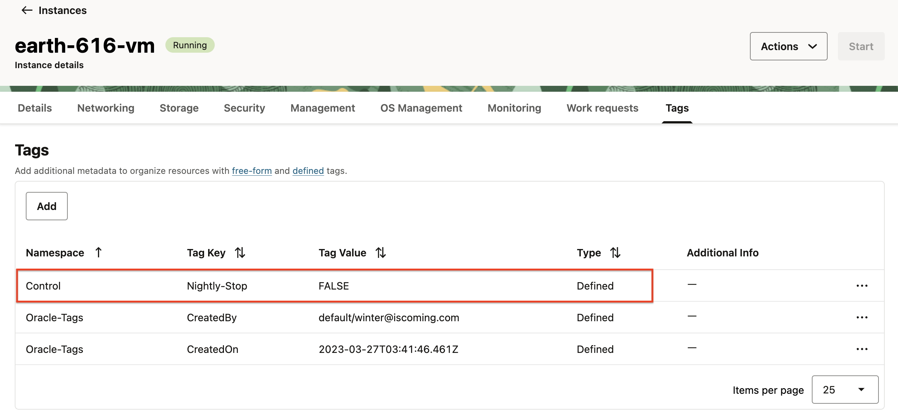
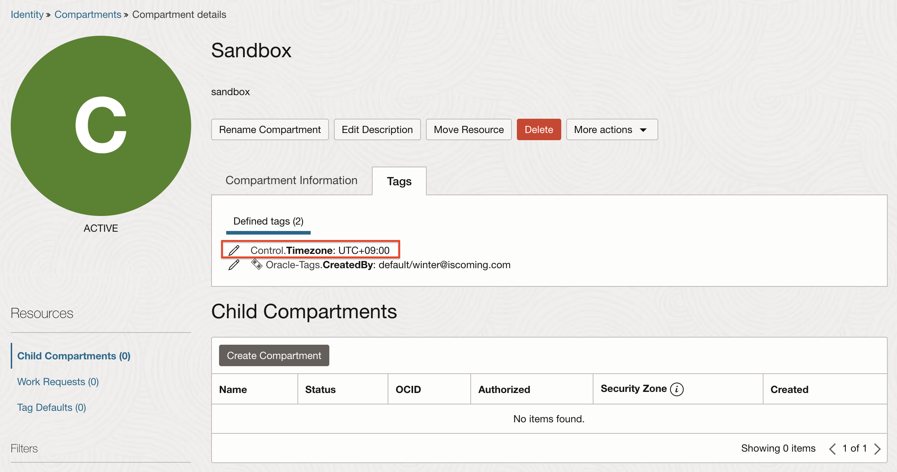

# oci-nigthly-stop
[](https://github.com/TheKoguryo/oci-nigthly-stop/blob/master/README.md)
[](https://github.com/TheKoguryo/oci-nigthly-stop/blob/master/README.ko.md)

Stop your OCI instances at night.
And change the license models of your Databases and others to BYOL.

## Supported Services for Stop
- Analytics Cloud
- Compute
- Data Integration
- Data Science
    * Notebook Sessions
    * Model Deployments
- Database
    * Base Database
    * Autonomous Database
- Digital Assistant
- GoldenGate
- HeatWave MySQL
- Oracle Integration 3
- Visual Builder

## Supported Services for Changing to BYOL 
- Analytics Cloud
- Database
    * Base Database
    * Autonomous Database
- GoldenGate  
- Oracle Integration 3


## Prerequisites
- [OCI SDK for Python](https://docs.oracle.com/en-us/iaas/Content/API/SDKDocs/pythonsdk.htm#SDK_for_Python)
- Python 3.6 and above
    * [Supported Python Versions and Operating Systems](https://docs.oracle.com/en-us/iaas/Content/API/SDKDocs/pythonsdk.htm#pythonsdk_topic-supported_python_versions__SupportedPythonVersionsandOperatingSystems)
- Pre-created oci-cli config file (~/.oci/config)
    * [OCI CLI Quickstart](https://docs.oracle.com/en-us/iaas/Content/API/SDKDocs/cliinstall.htm)

## How to use

### How to add tag

1. Go to OCI Console.

2. Create Tag Namespaces in Root compartment

    - Namespace Definition Name: `Control`

3. Create Tag Key Definitions

    |Tag Key       |Description                             | Tag Value Type|Value                                                      |
    |--------------|----------------------------------------|---------------|-----------------------------------------------------------|
    |`Nightly-Stop`|If FALSE, does not stop at 24:00        | List          |`TRUE`<br> `FALSE`                                         |
    |`BYOL`        |If FALSE, does not change license model | List          |`TRUE`<br> `FALSE`                                         |
    |`Timezone`    |Compartment level tag                   | List          |`UTC+07:00`<br> `UTC+08:00`<br> `UTC+09:00`<br> `UTC+09:30`|

    - If you need, add more values in Timezone.

4. If you want to exclude instances from stopping, set defined tags below for individual compute and other instances.

    

5. If you want to run nightly-stop at different times for each time zone, set defined tags - `Control.Timezone` for specific compartment.

    

### How to run oci-nightly-stop

1. Create a Compute Instance.

2. Install OCI CLI and configure the CLI in the created instance. And install OCI SDK for Python.

3. Clone this repository.

4. Open configuration.py file and set your enviroment values.

5. Run Example

    - Target:
    
        * all instances in the compartments that are tagged `Control.Timezone: UTC+09:00`

        ```$ run_nightly-stop.sh UTC+09:30 include```

    - Target: Except for those that are scheduled to run on other schedules.

        * all instances in the compartments that are no tagged `Control.Timezone`
        * all instances in the compartments that have other values, not `UTC+07:00`, `UTC+08:00`, `UTC+09:30` in `Control.Timezone`

        ```$ run_nightly-stop.sh UTC+07:00,UTC+08:00,UTC+09:30 exclude```

6. Use cron as your scheduler.

    - Run `crontab -e`

    - Create your schedules.

        ```
        ###############################################################################
        # Crontab to run oci-nigthly-stop at 24:00 in each time zone
        ###############################################################################
        # UTC+09:30
        30 14 * * * timeout 1h /home/opc/oci-nigthly-stop/run_nightly-stop.sh UTC+09:30 include >> /home/opc/oci-nigthly-stop/run_nightly-stop.sh_run.txt_`date +\%Y\%m\%d-\%H\%M\%S` 2>&1 

        # UTC+09:00 - If a compartment does not have a timezone tag or is tagged with the remaining timezones, resources belonging to that compartment will be targeted.
        00 15 * * * timeout 1h /home/opc/oci-nigthly-stop/run_nightly-stop.sh UTC+07:00,UTC+08:00,UTC+09:30 exclude >> /home/opc/oci-nigthly-stop/run_nightly-stop.sh_run.txt_`date +\%Y\%m\%d-\%H\%M\%S` 2>&1
        
        # UTC+08:00
        00 16 * * * timeout 1h /home/opc/oci-nigthly-stop/run_nightly-stop.sh UTC+08:00 include >> /home/opc/oci-nigthly-stop/run_nightly-stop.sh_run.txt_`date +\%Y\%m\%d-\%H\%M\%S` 2>&1   
        
        # UTC+07:00
        00 17 * * * timeout 1h /home/opc/oci-nigthly-stop/run_nightly-stop.sh UTC+07:00 include >> /home/opc/oci-nigthly-stop/run_nightly-stop.sh_run.txt_`date +\%Y\%m\%d-\%H\%M\%S` 2>&1                 
       
        ```
